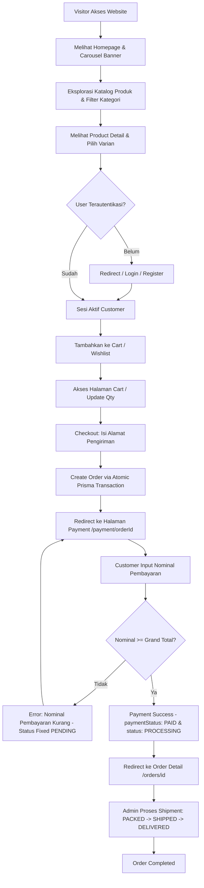
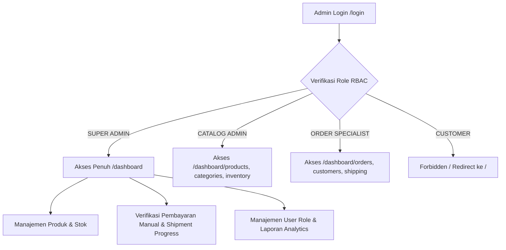
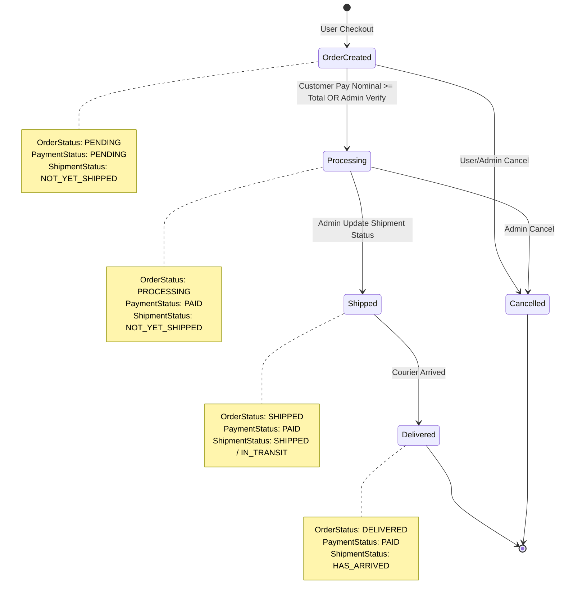
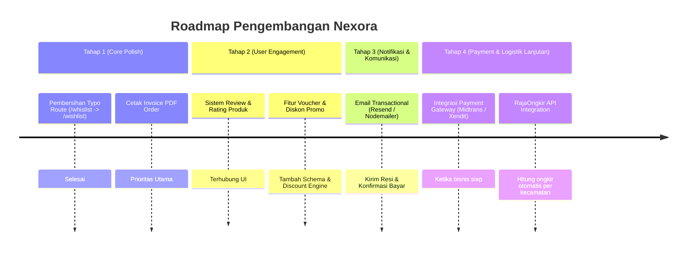

# DOKUMENTASI TEKNIS & ANALISIS ARSITEKTUR NEXORA E-COMMERCE

> **Dokumen Arsitektur Sistem & Analysis Bisnis**  
> **Status Project**: In Development (Manual Payment System Active)  
> **Framework Core**: Next.js (App Router), Prisma ORM, PostgreSQL, NextAuth.js (Auth.js v5), Tailwind CSS  

---

## 1. Flow Website (Alur Kerja Pengguna & Transaksi)

Sistem Nexora membagi alur kerja utama menjadi dua ranah utama: **Customer Flow** dan **Admin Management Flow**.

### A. Customer Flow (Alur Belanja & Transaksi Publik)



### B. Admin Management Flow



---

## 2. Analisis Role Management (RBAC)

Nexora menerapkan *Role-Based Access Control* (RBAC) 4 tingkat yang dikontrol melalui `middleware.ts`, `lib/rbac.ts`, dan `lib/admin/permissions.ts`.

| Fitur / Parameter | SUPER_ADMIN | CATALOG_ADMIN | ORDER_SPECIALIST | CUSTOMER |
| :--- | :--- | :--- | :--- | :--- |
| **Tujuan Role** | Kontrol penuh arsitektur platform & operasional bisnis. | Pengelolaan materi produk, varian, media & inventaris. | Pemrosesan transaksi order, verifikasi bayar, & kurir. | Pengguna pembeli (belanja, transaksi, wishlist, profil). |
| **Hak Akses** | All Routes (`/dashboard/*`, `/api/admin/*`, `/api/*`) | Product, Category, Inventory, Dashboard Read | Order, Customer, Shipping, Dashboard Read | Cart, Checkout, Order, Payment, Wishlist, Profile |
| **Menu Dashboard** | Products, Categories, Orders, Customers, Inventory, Shipping, Users, Reports, Settings | Products, Categories, Inventory | Orders, Customers, Shipping | (Menu Navbar Customer: Products, Cart, Orders, Wishlist) |
| **API Digunakan** | `/api/admin/*` (GET, POST, PUT, PATCH, DELETE) | `/api/admin/products/*`, `/api/admin/categories/*` | `/api/admin/orders/*`, `/api/admin/customers/*` | `/api/cart/*`, `/api/checkout`, `/api/orders/*`, `/api/wishlist` |
| **Tabel DB Fokus** | Semua Model Database | `Product`, `ProductVariant`, `Category`, `Brand`, `StockMovement` | `Order`, `OrderItem`, `Payment`, `Shipment`, `Address`, `User` | `Cart`, `CartItem`, `Wishlist`, `Order`, `Payment`, `Address` |
| **Halaman Boleh** | Semua Halaman Publik & Dashboard | `/dashboard`, `/dashboard/products/*`, `/dashboard/categories/*`, `/dashboard/inventory` | `/dashboard`, `/dashboard/orders`, `/dashboard/customers`, `/dashboard/shipping` | Halaman Publik, `/cart`, `/checkout`, `/orders/*`, `/payment/*`, `/wishlist` |
| **Halaman Terlarang** | Tidak Ada | `/dashboard/orders`, `/dashboard/users`, `/dashboard/reports`, `/dashboard/settings` | `/dashboard/products`, `/dashboard/categories`, `/dashboard/users`, `/dashboard/reports` | Semua Halaman `/dashboard/*` & API `/api/admin/*` |

---

## 3. Fungsi Setiap Menu Aplikasi

| Menu | Tujuan | Flow Operasional | Hak Akses Role | API Endpoint | Tabel DB Terkait |
| :--- | :--- | :--- | :--- | :--- | :--- |
| **Homepage (`/`)** | Etalase utama & banner promosi | Visitor melihat hero banner, fitur produk utama, dan navigasi produk. | Publik | Direct Server Render | `Banner`, `Product`, `Category` |
| **Products (`/products`)** | Katalog produk publik | Browsing produk dengan filter kategori, brand, pencarian keyword, & pagination. | Publik | Direct Server / Client Fetch | `Product`, `ProductVariant`, `Category`, `Brand` |
| **Product Detail (`/products/[slug]`)** | Informasi detail spesifikasi & varian | Pilih varian (warna/ram/storage), cek stok real-time, masukkan ke Cart/Wishlist. | Publik | Direct Server Fetch | `Product`, `ProductVariant`, `ProductImage`, `ProductSpecification` |
| **Cart (`/cart`)** | Keranjang belanja pengguna | Tambah/kurangi qty, hapus item, validasi stok max, hitung subtotal & total. | CUSTOMER | `/api/cart`, `/api/cart/[id]` | `Cart`, `CartItem`, `ProductVariant` |
| **Checkout (`/checkout`)** | Pengisian form pengiriman order | Input nama penerima, HP, alamat lengkap, validasi stok cart $\rightarrow$ buat order. | CUSTOMER | `/api/checkout` | `Cart`, `Address`, `Order`, `OrderItem`, `StockMovement` |
| **Payment (`/payment/[orderId]`)** | Simulasi pembayaran manual | Tampil Grand Total, input nominal, validasi nominal $\ge$ Grand Total $\rightarrow$ update PAID. | CUSTOMER | `/api/orders/[id]`, `/api/orders/[id]/payment` | `Order`, `Payment` |
| **Order History (`/orders`)** | Riwayat transaksi customer | Tampil daftar order, filter status, akses tombol "Pay Now" jika status `PENDING`. | CUSTOMER | `/api/orders` | `Order`, `OrderItem`, `Payment` |
| **Order Detail (`/orders/[id]`)** | Rincian lengkap order pengguna | Rincian produk, alamat pengiriman, status payment & shipment, rincian kembalian. | CUSTOMER | `/api/orders/[id]` | `Order`, `OrderItem`, `Payment`, `Shipment`, `Address` |
| **Wishlist (`/customer/wishlist`)** | Daftar produk favorit | Menambah/menghapus produk dari wishlist, pindahkan produk ke Cart. | CUSTOMER | `/api/wishlist` | `Wishlist`, `Product` |
| **Dashboard Main (`/dashboard`)** | Ringkasan indikator bisnis (KPI) | Tampil total revenue, total order, produk terlaris, stok menipis, order terbaru. | Admin Roles | `/api/admin/dashboard` | `Order`, `Product`, `User`, `ProductVariant` |
| **Admin Products (`/dashboard/products`)** | Manajemen Katalog Produk | Tambah produk baru, edit spesifikasi & varian, toggle published/featured, soft delete. | SUPER_ADMIN, CATALOG_ADMIN | `/api/admin/products`, `/api/admin/products/[id]` | `Product`, `ProductVariant`, `Brand`, `Category` |
| **Admin Categories (`/dashboard/categories`)** | Manajemen Kategori Produk | Tambah/edit nama, slug, deskripsi kategori, aktifkan/nonaktifkan status kategori. | SUPER_ADMIN, CATALOG_ADMIN | `/api/admin/categories`, `/api/admin/categories/[id]` | `Category`, `Product` |
| **Admin Orders (`/dashboard/orders`)** | Verifikasi Order & Pembayaran | Cek nominal bayar, verifikasi manual (`PENDING` $\rightarrow$ `PAID`), update pengiriman kurir. | SUPER_ADMIN, ORDER_SPECIALIST | `/api/admin/orders` | `Order`, `Payment`, `Shipment`, `OrderItem` |
| **Admin Customers (`/dashboard/customers`)** | Manajemen Pengguna Customer | Lihat daftar pembeli, riwayat total order per customer, atur status akun (Active/Block). | SUPER_ADMIN, ORDER_SPECIALIST | `/api/admin/customers` | `User`, `Order`, `Address` |
| **Admin Users (`/dashboard/users`)** | Manajemen Staff & Privilege | Ubah role staf (misal CUSTOMER $\rightarrow$ ORDER_SPECIALIST / CATALOG_ADMIN). | SUPER_ADMIN | `/api/admin/users` | `User` |
| **Admin Reports (`/dashboard/reports`)** | Laporan Keuangan & Penjualan | Grafik omset bulanan, item paling laku (Best Sellers), rasio customer baru. | SUPER_ADMIN | `/api/admin/reports` | `Order`, `OrderItem`, `User` |

---

## 4. Analisis Relasi Database (Prisma ERD Diagram)

```mermaid
erDiagram
    User ||--o{ Account : "auth accounts"
    User ||--o{ Session : "sessions"
    User ||--o1 Cart : "owns"
    User ||--o{ Address : "shipping addresses"
    User ||--o{ Order : "places"
    User ||--o{ Wishlist : "saves"
    User ||--o{ StockMovement : "records"
    
    Category ||--o{ Product : "classifies"
    Brand ||--o{ Product : "manufactures"
    Product ||--o{ ProductVariant : "has variants"
    Product ||--o{ ProductSpecification : "defines specs"
    ProductVariant ||--o{ ProductImage : "has images"
    ProductVariant ||--o{ CartItem : "contains in cart"
    ProductVariant ||--o{ OrderItem : "contains in order"
    ProductVariant ||--o{ StockMovement : "tracks movement"

    Cart ||--o{ CartItem : "holds items"
    
    Address ||--o{ Order : "ships to"
    Order ||--o{ OrderItem : "contains"
    Order ||--o1 Payment : "has single payment"
    Order ||--o1 Shipment : "has shipment detail"
    Courier ||--o{ Shipment : "delivers via"
```

### Penjelasan Relasi Kunci:
1. **User $\rightarrow$ Cart $\rightarrow$ CartItem $\rightarrow$ ProductVariant**: Relasi 1-to-1 antara User & Cart menjamin setiap user hanya memiliki 1 keranjang aktif. CartItem menghubungkan Cart dengan ProductVariant spesifik (bukan Product parent).
2. **Order $\rightarrow$ OrderItem $\rightarrow$ ProductVariant**: OrderItem menyimpan *snapshot* `price` saat transaksi terjadi untuk mencegah histori berubah jika harga master produk diubah di kemudian hari.
3. **Order $\rightarrow$ Payment (1-to-1 Unique)**: Setiap order hanya memiliki 1 record Payment untuk mencegah *duplicate payments*.
4. **ProductVariant $\rightarrow$ StockMovement**: Setiap pergerakan stok (Order Out, Adjust, In) dicatat secara auditabel pada `StockMovement` dengan melacak `stockBefore` dan `stockAfter`.

---

## 5. Analisis Flow Order (State Machine)

Status order dikontrol oleh tiga jenis enum status yang saling berhubungan: `OrderStatus`, `PaymentStatus`, dan `ShipmentStatus`.



---

## 6. Analisis Flow Payment (Manual Payment Architecture)

Sistem pembayaran Nexora dirancang secara realistis **tanpa membutuhkan gateway eksternal**:

1. **Inisiasi Payment**: Setelah checkout, sistem membuat `Order` dengan `paymentStatus = PENDING` dan meredirect user ke `/payment/[orderId]`.
2. **Input Nominal Pembayaran**: Customer menginputkan jumlah uang (misal Grand Total $100, user memasukkan $100 atau $120).
3. **Validasi Server-Side**:
   - Jika Nominal $<$ Grand Total: Transaksi ditolak (`Nominal pembayaran kurang`), `paymentStatus` tetap `PENDING`.
   - Jika Nominal $\ge$ Grand Total:
     - Hitung `changeAmount = paidAmount - grandTotal`.
     - Update `Order`: `paymentStatus = PAID`, `status = PROCESSING`.
     - Upsert data ke tabel `Payment`: `orderId`, `method = MANUAL`, `status = PAID`, `amount`, `paidAmount`, `changeAmount`, `paidAt = now()`.
4. **Verifikasi Manual oleh Admin**: Super Admin dapat memverifikasi pembayaran dari halaman `/dashboard/orders` dengan menekan tombol **"Verify Payment"** yang secara otomatis mengubah status dari `PENDING` menjadi `PAID`.

---

## 7. Analisis Flow Shipment (Pengiriman Produk)

Status pengiriman dikelola secara bertahap untuk merefleksikan proses logistik nyata:

1. **`NOT_YET_SHIPPED`**: Order baru dibayar, barang sedang disiapkan di gudang.
2. **`PACKED`**: Barang telah dikemas dan siap diserahkan ke kurir.
3. **`SHIPPED` / `IN_TRANSIT`**: Kurir telah mengambil barang (resi diinputkan oleh Admin). `OrderStatus` otomatis naik menjadi `SHIPPED`.
4. **`HAS_ARRIVED` / `DELIVERED`**: Barang telah sampai di alamat tujuan. `OrderStatus` otomatis menjadi `DELIVERED`.

---

## 8. Analisis Kekurangan & Status Fitur Project

### Fitur yang Sudah Selesai (Completed Features)

- ✅ **Authentication & Authorization**: Full RBAC 4 Role (Super Admin, Catalog Admin, Order Specialist, Customer) via Auth.js & Middleware.
- ✅ **Catalog Management**: Product CRUD, Category CRUD, Brand Management, Product Variant System, Dynamic Specs, Soft Delete & Restore.
- ✅ **Shopping Experience**: Product Filter, Search, Product Detail, Cart Management (Stock cap validation, qty update, auto subtotal/grand total).
- ✅ **Atomic Order Engine**: Check out menggunakan `prisma.$transaction()` (Address, Order, OrderItem, Stock reduction, StockMovement audit log, Clear cart).
- ✅ **Manual Payment Gateway Simulation**: Halaman pembayaran `/payment/[orderId]`, validasi nominal, perhitungan kembalian (*change amount*), dan verifikasi Super Admin.
- ✅ **Status Transition Validation**: Proteksi regresi status (mencegah `DELIVERED` $\rightarrow$ `PROCESSING` atau `PAID` $\rightarrow$ `PENDING`).
- ✅ **Admin Dashboard**: Analytics ringkas (Revenue, Best Sellers, Low Stock alert, Monthly Sales).

### Fitur yang Belum Selesai (Unfinished / Roadmap Features)

- ❌ **Automatic Payment Gateway Integration** *(Disengaja sesuai spesifikasi Manual Payment)*.
- ❌ **Product Review & Rating System**: Schema `Review` sudah ada di Prisma, namun UI & API input review pembeli belum terhubung.
- ❌ **Voucher & Discount Coupon System**: Belum ada model tabel promo/coupon untuk memotong harga di Cart/Checkout.
- ❌ **Automated Email Notification**: Belum ada service SMTP/Resend untuk mengirimkan email konfirmasi order dan nomor resi.
- ❌ **PDF Invoice Generator**: Belum ada export cetak invoice PDF untuk pembeli dan admin.
- ❌ **Advanced Courier Shipping Rates API**: Pengiriman saat ini menggunakan nilai statis (Free Shipping/Flat).

---

## 9. Persentase Progress Project

| Modul / Komponen | Progress | Alasan Penilaian |
| :--- | :---: | :--- |
| **Authentication & RBAC** | **100%** | Middleware, RBAC multi-role, proteksi API, dan proteksi halaman berjalan sempurna. |
| **Products & Categories** | **95%** | Catalog CRUD lengkap, varian stok, dan image management selesai (hanya belum ada multi-select bulk delete). |
| **Cart & Checkout Engine** | **100%** | Menggunakan transaksi atomic Prisma, validasi stok real-time, dan rollback otomatis. |
| **Manual Payment System** | **100%** | Flow pembayaran manual, validasi nominal, kembalian, dan verifikasi admin selesai 100%. |
| **Order Management** | **90%** | Alur status order lengkap & tervalidasi. Tinggal melengkapi cetak invoice. |
| **Shipment Tracking** | **80%** | Alur status shipment & kurir ada, belum terintegrasi dengan API lacak resi eksternal. |
| **Wishlist & Customer Pages** | **85%** | Wishlist API & UI aktif. Perlu pembersihan route typo lama (`/whislist`). |
| **Dashboard & Analytics** | **85%** | KPI summary, best seller report, dan sales list sudah berjalan. |
| **Review & Ratings** | **20%** | Schema database sudah siap, UI customer belum terhubung. |
| **OVERALL PROJECT** | **88%** | **Sistem E-Commerce Core & Operasional Manual Payment telah siap berproduksi.** |

---

## 10. Roadmap Pengembang Ke Depan



---

## 11. Temuan (Findings) & Rekomendasi Arsitektur

Saat melakukan analisis menyeluruh terhadap codebase, ditemukan beberapa poin teknis yang perlu dicatat untuk perbaikan mendatang (tanpa mengubah kode saat ini):

1. **Typo Nama Directory Route**:
   - Ditemukan folder `app/whislist/page.tsx` (salah eja `whislist`).
   - *Rekomendasi*: Hapus folder typo `app/whislist` karena modul wishlist customer yang aktif dan lengkap sudah berada di `app/customer/wishlist/page.tsx`.
2. **Penanganan Serialisasi Prisma Decimal**:
   - Beberapa komponen admin memanggil `.toNumber()` pada field Prisma `Decimal`.
   - *Rekomendasi*: Pastikan semua pemanggilan nilai `Decimal` di-cast secara konsisten menggunakan `Number(val)` agar aman dari runtime error saat data null.
3. **Format Tanggal pada Laporan Dashboard**:
   - `groupBy` pada `monthlySales` mengelompokkan data berdasarkan timestamp persis `createdAt`.
   - *Rekomendasi*: Gunakan penanggalan berbasis bulan (`YYYY-MM`) pada query agregasi laporan agar data penjualan bulanan terkumpul secara lebih rapi.

---

### Kesimpulan

Project **Nexora** memiliki arsitektur yang sangat solid, rapi, dan modular. Penggunaan **Next.js App Router**, **Prisma ORM**, dan **Auth.js** telah diterapkan sesuai dengan *best practice* industri modern. Alur bisnis transaksi utama dari keranjang belanja hingga verifikasi pembayaran manual telah berfungsi secara utuh dan aman.
